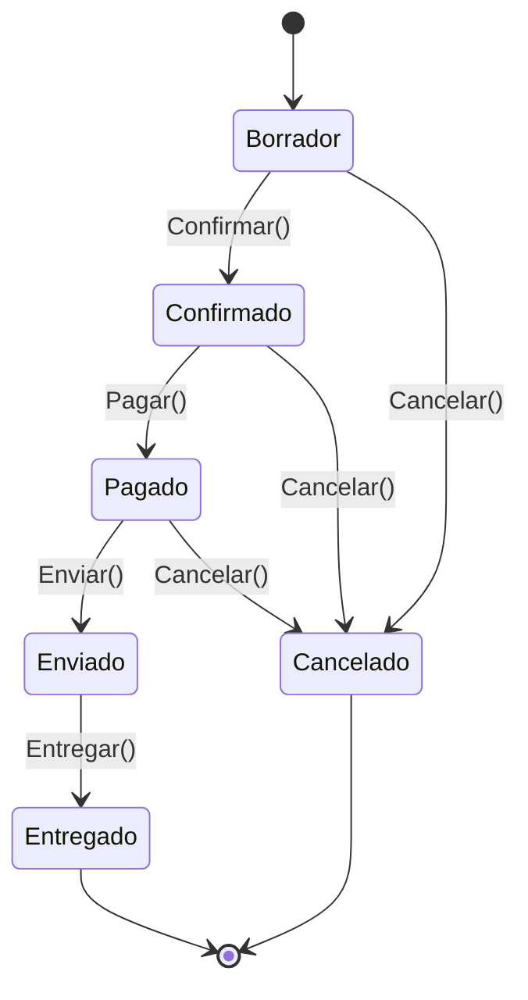

# Manual del alumno — M2.2 · Técnicas de diseño de casos

Esto **no** es el [`README.md`](README.md). Este manual te cuenta el *porqué*: cómo elegir, con
método, qué puñado de casos cubre de verdad un comportamiento — en vez de probar valores al azar.

Tiempo de lectura: ~12 min. Submódulo M2.2 (Estrategia y Cobertura). **Aquí ya hay tests reales**: los
encuentras en `tests/VentasShop.TestsUnitarios/` y se ejecutan con `dotnet test`.

---

## 1. La idea en una frase

No se prueban valores al azar: **cuatro técnicas te dicen qué casos cubren de verdad el comportamiento
y cuáles son repetir lo mismo con otro número.**

---

## 2. El gancho: diez tests y el 500 que falta

Un compañero ha testeado el cálculo de descuentos. Está contento, ha escrito un montón de tests:
pedido de 100 €, de 200 €, de 300 €… diez tests, todos del mismo tramo, todos comprobando lo mismo.
Le preguntas: "¿y el de 500 € clavado?". Silencio. No está. Justo el borde donde cambia la regla, el
único caso que escondía un bug, se quedó fuera. Diez tests de trabajo, cero protección donde importaba.

Le falta un método para elegir casos. Porque los valores posibles son infinitos y tu tiempo no.

---

## 3. Catar la sopa sin bebértela entera

Cocinas una olla y quieres saber si está de sal. ¿Te la bebes entera? No: remueves y pruebas una
cucharada — esa cucharada representa el todo. Acabas de hacer **partición en clases de equivalencia**.
Pero un buen cocinero sabe que hay sitios que no se comportan como el resto: el fondo, donde la sal se
posa; el borde pegado al fuego. Esos los pruebas aparte: **análisis de valores límite**. Si la receta
combina sal, picante y ácido, pruebas las combinaciones que importan: **tabla de decisión**. Y si el
plato se hace por fases y el orden manda: **transición de estados**.

Cuatro cucharas para la misma olla. El resto es saber cuándo usar cada una.

---

## 4. Partición en clases de equivalencia

Si un grupo de valores se va a comportar igual, te basta con probar uno. El descuento por volumen
tiene tres tramos (< 100, 100–500, ≥ 500): tres comportamientos distintos, tres tests bien elegidos.
Los diez tests del compañero caían todos en la clase media — diez cucharadas del mismo punto.

→ En el repo: `CalculadoraDescuentosTests.CasosPorTramo` (un representante por tramo).

## 5. Análisis de valores límite

Los bugs se concentran en las fronteras: el `>` que debía ser `>=`, el cero, el último elemento. El
centro (250 €) no esconde decisiones; la frontera de los 500 € sí: ¿`>= 500` o `> 500`? Para cada
frontera, prueba el límite exacto y sus vecinos: 499,99 / 500,00 / 500,01.

→ En el repo: `CalculadoraDescuentosTests.CasosFrontera`. El caso del **500,00** es el que se pondría
rojo si alguien cambia `>=` por `>`.

> **Detalle de xUnit que cuesta caro:** un `[InlineData(...)]` **no admite constantes `decimal`** (los
> literales en un atributo son `double`, y xUnit revienta al convertirlos). Por eso los casos con
> decimales van en un **`TheoryData<decimal, decimal>`** con literales `m`, que es código normal y sí
> compila. Con enteros, `[InlineData]` vale (lo ves en `CantidadTests`).

## 6. Tabla de decisión

Cuando el resultado sale de **combinar** condiciones, lo que falla suele ser la combinación. El
descuento depende del importe **y** del tipo de cliente:

| Importe \ Tipo | Estándar | Premium (+3%) | VIP (+5%) |
|---|---|---|---|
| < 100 € | 0% | 3% | 5% |
| 100–500 € | 5% | 8% | 10% |
| ≥ 500 € | 10% | 13% | **15% (tope)** |

Esa celda de abajo a la derecha es la importante: 10% + 5% = 15%, justo en el tope (BR-05). Un test
ingenuo que prueba importe y tipo por separado nunca la toca.

→ En el repo: `CalculadoraDescuentosTests.CasosImporteYTipo` (incluye el tope).

## 7. Transición de estados

Un `Pedido` no es un dato suelto: viaja por una vida, y no todas las transiciones valen.

La técnica dice: prueba las transiciones **válidas** (que funcionen) y, sobre todo, las **inválidas**
(que se rechacen). Enviar un pedido sin pagar tiene que fallar — si falta ese test, el día que alguien
se salte el pago hay un problema de dinero de verdad.

→ En el repo: `PedidoEstadosTests` (válidas del camino principal + inválidas + BR-07: pagar sin líneas).

---

## 8. Cuál usar y cuándo (no eliges una)

Casi nunca eliges una; las encadenas. Ante un método con entradas: **partición** para saber cuántos
comportamientos hay → **valores límite** para afinar el valor de cada clase → **tabla de decisión** si
el resultado combina varias entradas → **transición de estados** si lo que pruebas tiene ciclo de vida.

---

## 9. Lo que te llevas

El laboratorio ([`material/labs/M2.2-tecnicas-de-diseno.md`](material/labs/M2.2-tecnicas-de-diseno.md))
te hace recorrer las cuatro sobre VentasShop. La tarjeta
[`material/tarjetas/M2.2-tecnicas.md`](material/tarjetas/M2.2-tecnicas.md) las resume para el día a día.

Ejecuta los tests de esta rama con `dotnet test tests/VentasShop.TestsUnitarios` y míralos en verde.

Una cosa queda pendiente y abre el siguiente submódulo: ya tienes tus tests, pero ¿cómo sabes si son
*suficientes*? ¿Cómo mides cuánto de tu código tocan de verdad? Hay una métrica que promete responder
—la cobertura— y que, mal entendida, hace más daño que bien. Es el **M2.3**.
