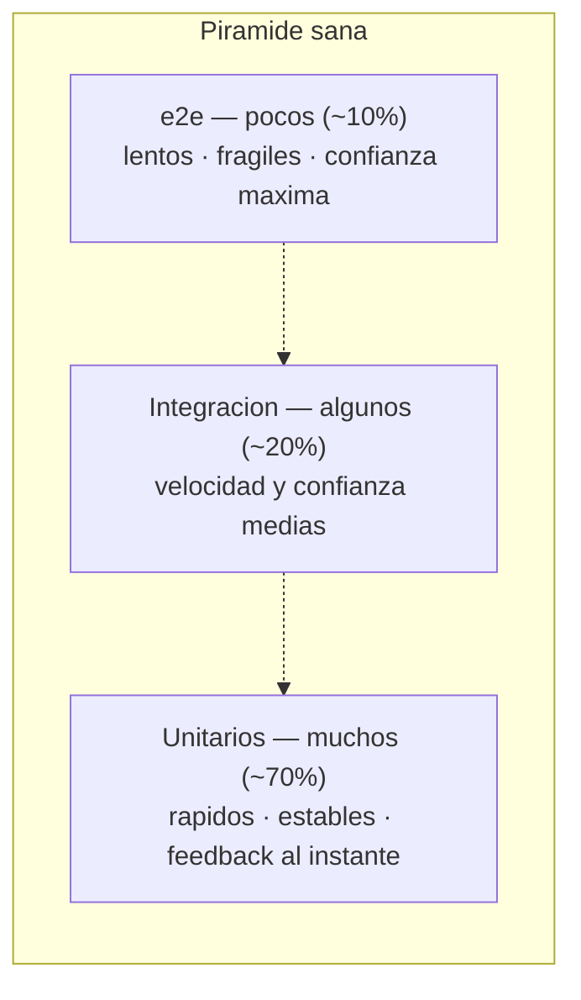
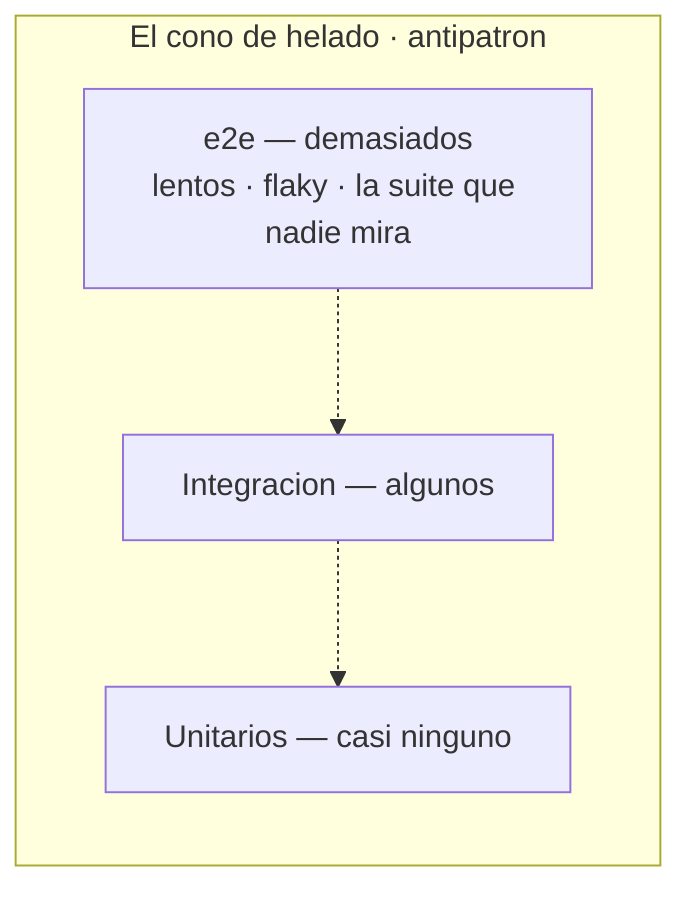

# Manual del alumno — M1.2 · La pirámide de testing

Esto **no** es el [`README.md`](README.md) (la ficha técnica de la rama). Este manual te cuenta el
*porqué*: cómo repartir el esfuerzo entre tipos de test para no acabar con una suite que nadie mira.

Tiempo de lectura: ~10 min. Submódulo M1.2 (Fundamentos). Rama **conceptual**: aquí no se escribe
código de test —eso empieza en M2—; lo que se entrena es **decidir el reparto**.

---

## 1. La idea en una frase

La forma de pirámide no es estética: **muchos tests rápidos abajo, pocos lentos arriba, porque
velocidad y confianza tiran en direcciones opuestas.**

---

## 2. El desastre que le da nombre

Casi todo el que empieza cae en el mismo sitio, y el razonamiento hasta parece impecable: si los
tests que más se parecen a lo que hace el usuario son los de punta a punta —abrir la aplicación,
pinchar, rellenar, enviar—, esos dan la confianza de verdad. Así que escribes un montón de esos. Y
al principio va de maravilla.

Hasta que la suite crece. Tarda veinte minutos. Luego cuarenta. Y empieza a fallar sola: un test se
cae porque un botón cambió de sitio, otro porque la red fue lenta esa vez, otro porque el de antes
dejó datos a medias. Fallos que no son bugs — son ruido. Y cuando una suite falla por todo menos
por bugs, pasa lo inevitable: la gente deja de mirarla. *"Otra vez en rojo, será el entorno, dale
otra vez."* El día que el rojo era de verdad, ya nadie lo ve.

A ese desastre se le ha dado forma de figura para que lo reconozcas y no lo repitas. Una pirámide.

---

## 3. Los tres niveles

Los tests se agrupan en tres niveles según cuánto sistema real meten dentro:

- **Unitarios** — prueban una pieza pequeña y aislada (una clase, un método, una regla). Sin base de
  datos, sin red. Le das entradas, miras la salida. Son los del `CalculadoraDescuentos`. Como no
  tocan nada externo, vuelan: miles se ejecutan en segundos, y cuando uno falla te señala la pieza
  exacta.
- **Integración** — prueban que varias piezas funcionan juntas, con las de fuera de verdad: tu
  código contra una base de datos real, el ORM, otro servicio. Más realismo, más lentos, más
  laboriosos. Cazan los fallos de las costuras entre tu código y el mundo.
- **Punta a punta (e2e)** — prueban el sistema entero como una persona: del navegador a la base de
  datos y vuelta. Los que más confianza dan y los más lentos y frágiles, por la misma razón: hay mil
  piezas en juego y cualquiera puede fallar por algo que no es un bug.

El patrón es toda la historia del módulo en una línea: **a más realismo, más confianza, pero más
lentitud y más fragilidad.** Subir de nivel siempre es ese intercambio.

---

## 4. Por qué la forma es una pirámide

Si abajo está lo barato, rápido y estable, y arriba lo caro, lento y frágil, ¿de cuáles te interesa
tener muchos y de cuáles pocos? La respuesta cae sola: muchos abajo, pocos arriba.

No es estética: es la consecuencia de que velocidad y confianza tiran en direcciones opuestas.
Quieres feedback rápido —eso empuja hacia abajo— y confianza de que el sistema entero va —eso empuja
hacia arriba—. La pirámide es el reparto que te compra casi toda la confianza sin renunciar a la
velocidad.

---

## 5. La proporción 70/20/10 (y por qué no te la creas del todo)

Vas a ver repetida una proporción: 70% unitarios, 20% integración, 10% e2e. Está bien como punto de
partida. Pero no la apuntes como si fuera la tabla periódica.

Esos números no salen de ninguna ley. El reparto bueno depende de lo que construyes: una librería de
cálculo es casi toda lógica pura (90% unitarios y está perfecta así); una aplicación que solo mueve
datos entre una API y una pantalla igual necesita más integración, porque su riesgo está en las
costuras. La regla de verdad no es el número, es la **forma**: muchos rápidos abajo, pocos lentos
arriba. Si la respetas, da igual que sea 70/20/10 o 60/30/10.

---

## 6. El antipatrón: la pirámide del revés

Le das la vuelta y sale un helado de cucurucho: pocos unitarios en la punta de abajo, un montón de
e2e desbordándose arriba. Por eso se le llama **el cono de helado**, y es el desastre del principio,
ahora dibujado.

Casi nunca se llega ahí por una decisión consciente: se llega por inercia. El equipo prueba todo a
mano, un día decide "vamos a automatizar lo que ya hacemos", y resulta que lo que hacían eran clics
de punta a punta. Los síntomas se reconocen enseguida: la suite tarda una eternidad, falla de forma
intermitente sin que haya bugs reales —lo que se llama tests *flaky*, o inestables, que veremos a
fondo en el Módulo 7— y, al final, la gente deja de mirarla. No es solo subóptimo: da una sensación
de cobertura que no es real y entrena al equipo a no fiarse de los rojos.

Si te llevas un único diagnóstico: si tu suite tarda demasiado y falla por todo menos por bugs, mira
la forma antes que nada. Casi seguro la tienes invertida.

---

## 7. VentasShop sobre la pirámide

El reparto cae casi solo en cuanto miras dónde está la chicha de cada parte:

- **Base (unitarios):** el `CalculadoraDescuentos`, las reglas de transición de estado del `Pedido`,
  las invariantes de `Cantidad`. Lógica pura, sin dependencias. Unitarios a montones, en
  milisegundos.
- **Franja media (integración):** guardar y recuperar un `Pedido` de la base de datos, comprobar que
  una restricción de la tabla se respeta de verdad. Mete la base de datos real — Módulo 6.
- **Punta (e2e):** un puñado pequeño y bien elegido. "Un cliente crea un pedido, lo paga y le llega
  confirmado". El camino que, si se rompe, no vendes. Ese, y poco más.

Y fíjate en lo que **no** haríamos: un e2e que arranca la tienda entera solo para comprobar que un
descuento del 10% se calcula bien. Eso es un unitario disfrazado de e2e: pagas toda la lentitud y la
fragilidad de un test de punta a punta para verificar una regla que un unitario comprueba en un
milisegundo. Reconocer esa confusión —¿esto de qué nivel es de verdad?— es media batalla del reparto.

---

## 8. Lo que te llevas

Ya sabes en qué nivel vive cada test y en qué proporción los quieres. El laboratorio
([`material/labs/M1.2-reparto-piramide.md`](material/labs/M1.2-reparto-piramide.md)) es de eso:
colocar comprobaciones en su nivel y cazar el unitario disfrazado de e2e. Y para tenerlo a mano
cuando diseñes tu suite, la tarjeta de decisión
[`material/tarjetas/M1.2-que-nivel.md`](material/tarjetas/M1.2-que-nivel.md).

Falta una pieza más sutil para cerrar los fundamentos: ¿qué hace que un test concreto sea *bueno*?
Puedes tener la pirámide perfecta y, dentro, tests que son una bomba de relojería. Hay cinco
propiedades que lo distinguen, se resumen en una palabra —**FIRST**— y son el **M1.3**.
