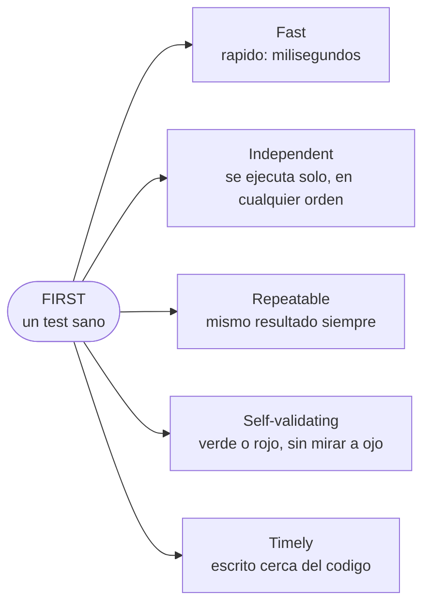

# Manual del alumno — M1.3 · Las propiedades F.I.R.S.T. de un buen test

Esto **no** es el [`README.md`](README.md). Este manual te cuenta el *porqué*: qué hace que un test
concreto sea **bueno**, más allá de tenerlo en el nivel correcto de la pirámide.

Tiempo de lectura: ~10 min. Submódulo M1.3 (Fundamentos), cierra el Módulo 1. Rama **conceptual**:
aquí no se escribe código de test; se entrena el olfato para reconocer un test que te va a dar guerra.

---

## 1. La idea en una frase

Un test que tarda, depende de otros o falla según el día no te protege: **te entrena para ignorar
los rojos.** Y un solo test así contamina la confianza en todos los demás.

---

## 2. El problema real: "ese test falla a veces, dale otra vez"

Ya sabes repartir los tests en la pirámide. Pero puedes tener la forma perfecta y, dentro, tests
malos. Y un test malo es peor que no tener test, porque ocupa, da falsa sensación de seguridad y, lo
grave, te enseña a desconfiar.

El caso clásico: un equipo tiene un test que, de vez en cuando, falla. No siempre. Nadie sabe por qué
y nadie tiene tiempo de averiguarlo, así que se instala la frase más cara de la profesión: *"ese test
falla a veces, no le hagas caso, dale otra vez"*. Y le dan otra vez, y pasa, y a producción.

El problema no es que ese test sea inútil. Es que ha entrenado al equipo entero a ignorar un rojo. Y
el día que el rojo sea de verdad, la reacción aprendida será la misma. El test malo contamina la
confianza en todos los demás.

Para que eso no pase, hay cinco propiedades que cumple un test sano. Alguien las juntó en un acrónimo
que se queda: **FIRST**.

---

## 3. FIRST, de un vistazo

No es una checklist que repases con bolígrafo: es una forma de *oler* cuándo un test te va a dar
problemas. Cuando uno te moleste, casi siempre incumple una de estas cinco, y tener los nombres te da
el vocabulario para diagnosticarlo.

Las acuñaron Tim Ottinger y Brett Schuchert, y las popularizó Robert C. Martin en *Clean Code*.

---

## 4. Las cinco, con su olor y su cura

- **Fast (rápido).** Milisegundos, no segundos. La velocidad es lo que hace que de verdad los uses, y
  un test que no usas no protege. *Olor:* tarda. *Causa nº1:* tocar cosas de fuera (base de datos,
  red, disco). *Cura:* aislar esas dependencias — el Módulo 5.
- **Independent (independiente).** Cada test se ejecuta solo, sin depender de que otro corriera antes
  ni del orden. *Olor:* falla cuando cambias el orden o paralelizas. *Cura:* cada test se monta su
  propio escenario desde cero y lo deja limpio. Vuelve como buena práctica en M7.3; los builders de
  M3.3 son la herramienta.
- **Repeatable (repetible).** Mismo resultado siempre: tu máquina, la del compañero, el servidor, hoy
  y dentro de seis meses. *Olor:* pasa unas veces y falla otras sin tocar el código → un test *flaky*,
  o inestable. *Causa típica:* el reloj (`DateTime.Now`), la aleatoriedad, el orden de una colección.
  *Cura:* el test controla todo lo que afecta a su resultado (en VentasShop, el reloj se inyecta —
  `IReloj` —, no se lee suelto).
- **Self-validating (se valida solo).** El test dice él solito si pasó o falló: verde o rojo, sin que
  mires la consola ni compares a ojo. *Olor:* un `Console.WriteLine` con un humano de árbitro. *Cura:*
  termina en una **aserción** que la máquina comprueba (la sintaxis, en M5.3).
- **Timely (escrito a tiempo).** El test se escribe **cerca** del código, no meses después. En su
  versión estricta es TDD (test antes del código), pero no hace falta comprarlo entero: lo útil es
  escribirlo pegado a la feature, no en una "fase de testing al final" que se la come el recorte.

---

## 5. VentasShop pasa el filtro FIRST

Coge un test real: *"un pedido de 500 € de un cliente estándar lleva un 10 % de descuento"*.

- **Rápido:** solo toca el `CalculadoraDescuentos`, lógica pura: menos de un milisegundo.
- **Independiente:** se construye su propio pedido; no necesita que otro test se haya ejecutado antes.
- **Repetible:** no depende del reloj — el 10 % es el 10 % hoy y el día de Navidad.
- **Se valida solo:** termina en una aserción (`tasa == 0.10m`), verde o rojo.
- **Timely:** se escribe a la vez que la regla de descuento.

La versión tóxica del mismo test: si leyera la fecha real con `DateTime.Now` para mirar una promoción
del día, dejaría de ser repetible. Y bastaría con que reutilizara un pedido que dejó otro test para
cargarse la independencia. Misma intención, mismo nombre, y un test inservible. FIRST es la lupa para
ver esa diferencia.

---

## 6. Lo que te llevas

Con esto cierras los fundamentos: el porqué (M1.1), la forma de repartir (M1.2) y el olfato para
distinguir un test sano de uno tóxico (M1.3). El laboratorio
([`material/labs/M1.3-diagnostico-first.md`](material/labs/M1.3-diagnostico-first.md)) es de
diagnóstico: por cada test, qué letra de FIRST incumple. Y la tarjeta
[`material/tarjetas/M1.3-first.md`](material/tarjetas/M1.3-first.md) la tienes para el día a día.

A partir de aquí todo es bajarlo a las manos. La primera pregunta de las manos es la del Módulo 2: de
todo lo que hace tu sistema, ¿qué merece un test y qué no? Porque testear de más es tan caro como
testear de menos.
