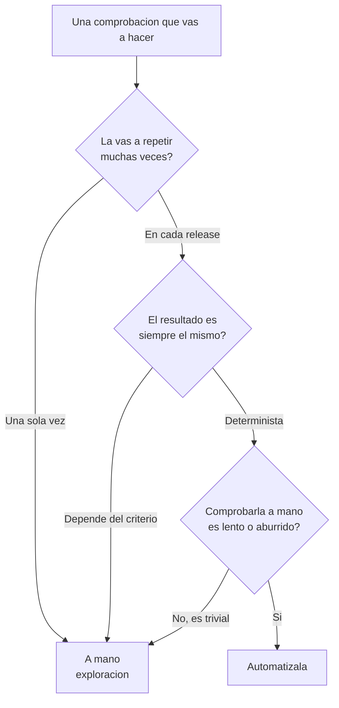
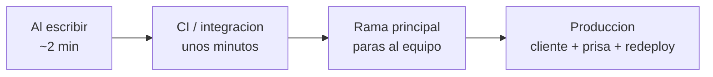
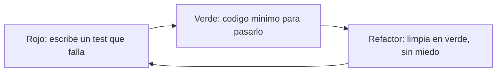

# Manual del alumno — M1.1 · Conceptos clave de testing

Esto **no** es el [`README.md`](README.md). El README es la ficha técnica de esta rama: qué hay,
cómo se compila, qué encontrarás. Este manual va antes y te cuenta el *porqué*: qué decisión
silenciosa entrena este submódulo y por qué la idea del seguro te va a acompañar todo el curso.

Tiempo de lectura: ~10 min. Submódulo de referencia: M1.1 (Fundamentos de Testing). Esta rama es
**conceptual**: todavía no se escribe ni un test —la herramienta, xUnit, llega en el Módulo 4—. Lo
que se entrena aquí es la cabeza: cuándo un test te ahorra un problema y cuándo es ceremonia.

---

## 1. La idea en una frase

Un test automatizado es un seguro: lo escribes una vez y te avisa cada vez que el código deja de
hacer lo que decidiste que hiciera.

No prueba que tu código funciona hoy —eso ya lo sabes, si no, no lo habrías dado por bueno—. Salta
dentro de tres meses, cuando alguien toque otra cosa y rompa esta sin querer.

---

## 2. El problema real que hay detrás

A una formación de testing se llega defendiéndose, y casi siempre con una de estas tres cabezas
puestas. Mira a ver si reconoces la tuya.

**El que no tiene tiempo.** Tiene un backlog que da miedo y los tests le suenan a trabajo extra que
nadie le paga. Lo que no ve es que el tiempo no se pierde, se adelanta: el caro es el otro, el del
bug en producción un domingo por la tarde.

**El que cree que es cosa de QA.** Su trabajo es escribir la feature, no probarla. Pero el testing
del que hablamos aquí lo escribe quien programa, pegado al código, no otro departamento al final.

**El que le da a F5 y ya.** Ha probado a mano, ha visto que sale lo que tenía que salir, y a otra
cosa. El problema es que ese F5 lo va a repetir a mano cada vez que toque algo, durante dos años,
hasta el día que se le olvide justo el caso que importaba.

Los tres tienen parte de razón. Y los tres se llevan la misma sorpresa: el testing no va de probar
por religión, va de saber **qué proteger para poder cambiar el resto con tranquilidad**.

---

## 3. Un test es un seguro

Piensa en un seguro —el del coche, el del hogar—. El día que lo firmas es un fastidio: pagas y no
pasa nada, porque ese día no se ha roto nada. Si lo juzgaras por el día de la firma, dirías que es
dinero tirado.

No se valora ahí. Se valora el día, meses después, en que el granizo te revienta el parabrisas. Y
hay algo más fino: un buen seguro te deja *vivir tranquilo* mientras tanto —te atreves a aparcar en
la calle, a hacer el viaje largo—. No es solo una red para la desgracia: es permiso para moverte.

Un test es exactamente eso. El día que lo escribes parece una prima pagada a cambio de nada. Pero
está para dentro de tres meses, y mientras tanto te da el permiso para tocar tu propio código sin
miedo. Guárdate la imagen; vuelve en cada módulo.

---

## 4. ¿Automatizar o dejarlo a mano?

Que defendamos lo automatizado no quiere decir que el manual sobre. Conviven, pero cada uno es bueno
para cosas distintas, y casi todo el desperdicio sale de cruzarlos: automatizar una exploración que
haces una vez, o condenar a una persona a repetir a mano cuarenta comprobaciones en cada release.

La regla práctica es esta: **automatiza lo repetitivo y determinista; deja el criterio y la
exploración para las personas.** Antes de escribir un test, pásalo por este filtro:

Ese es justo el ejercicio de esta rama: ver una lista de comprobaciones y decidir cuáles caen a cada
lado. Lo tienes resuelto en
[`material/labs/M1.1-automatizar-o-no.md`](material/labs/M1.1-automatizar-o-no.md), y como tarjeta de
decisión para tener a mano, [`material/tarjetas/M1.1-automatizar-o-no.md`](material/tarjetas/M1.1-automatizar-o-no.md).

---

## 5. Para qué sirve de verdad (los tres usos)

Pregunta a diez programadores para qué sirven los tests y nueve dirán «para encontrar bugs». Es
cierto, pero es la parte pequeña. Hay tres usos, y van de menor a mayor importancia, al revés de como
los ordena la intuición:

1. **Detectar errores.** Útil, pero es lo que menos te cambia la vida: un bug lo acabas encontrando
   de un modo u otro; el test solo lo encuentra antes y más barato.
2. **Dejar por escrito qué hace el código.** Un test que se llama `CalcularDescuento_Supera500_Aplica10`
   es una especificación que, además, **falla en rojo** el día que el código deja de cumplirla.
   Documentación que no puede mentir.
3. **Dejarte tocar el código sin miedo.** Este es el corazón. ¿Cuántas veces has dejado un método
   feo como estaba, pensando «si funciona, no lo toques», por no jugártela? Con una buena red de
   tests cambias, ejecutas, y en diez segundos sabes si rompiste algo. Refactorizar deja de ser una
   apuesta. Por eso los proyectos bien testeados envejecen mejor: la gente se atreve a mejorarlos.

---

## 6. El coste del bug: por qué pillarlo pronto importa

Hay una idea con décadas de profesión detrás: cuanto más tarde encuentras un fallo, más caro sale
arreglarlo. Sigue al mismo bug por su recorrido y se ve solo:

Honestidad: circulan tablas que dicen «1-10-100-1000». Vienen de estudios viejos y la gente seria
las pone en duda como medida exacta, así que no te las vendo como ley. Lo que no discute nadie es la
**forma** de la curva: crece, y crece rápido. Cada test que mueve el descubrimiento de un fallo
«hacia la izquierda», hacia el momento de escribirlo, te ahorra dinero real. A eso se le llama
*shift left*.

Lo verás con cara y ojos en VentasShop: un `>=` que alguien cambia por `>` deja el pedido de 500 €
exactos sin su descuento. A mano no lo pilla nadie —¿quién prueba el 500 clavado?—; un test lo caza
el mismo día. Dos minutos contra tres semanas y un cliente enfadado.

---

## 7. TDD: lo nombramos, no lo practicamos

Tarde o temprano aparece TDD —escribir el test *antes* que el código—. Su ciclo tiene tres tiempos:

¿Funciona? A mucha gente le cambia la forma de programar; a otra le resulta forzado y no lo adopta,
y no pasa nada. Este no es un curso de TDD. Quédate con la idea de fondo, que vale hagas TDD estricto
o no: **pensar cómo vas a comprobar que algo funciona, antes de escribirlo, te obliga a entender qué
tiene que hacer.**

---

## 8. Lo que te llevas de esta rama

Arrancas el curso con la mentalidad correcta: no «testeo porque toca», sino «qué quiero que esté
protegido para cambiar el resto con tranquilidad». La primera habilidad no es teclear `[Fact]`, es
**decidir qué merece automatizarse** —el lab de esta rama—.

Lo siguiente es la pregunta incómoda: si tuvieras que testear *todo*, no acabarías nunca. Entonces,
¿qué se testea, a qué nivel y cuánto de cada cosa? Hay una forma muy visual de ordenarlo, lleva
décadas funcionando y se dibuja como una pirámide. Es el **M1.2**.
